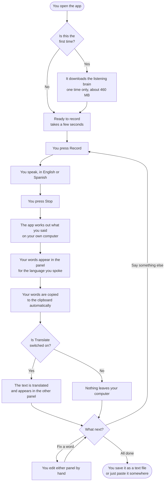
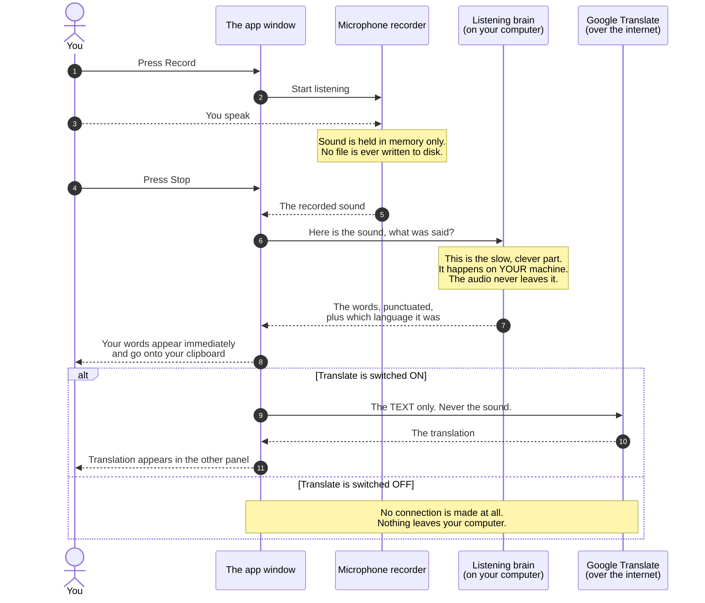
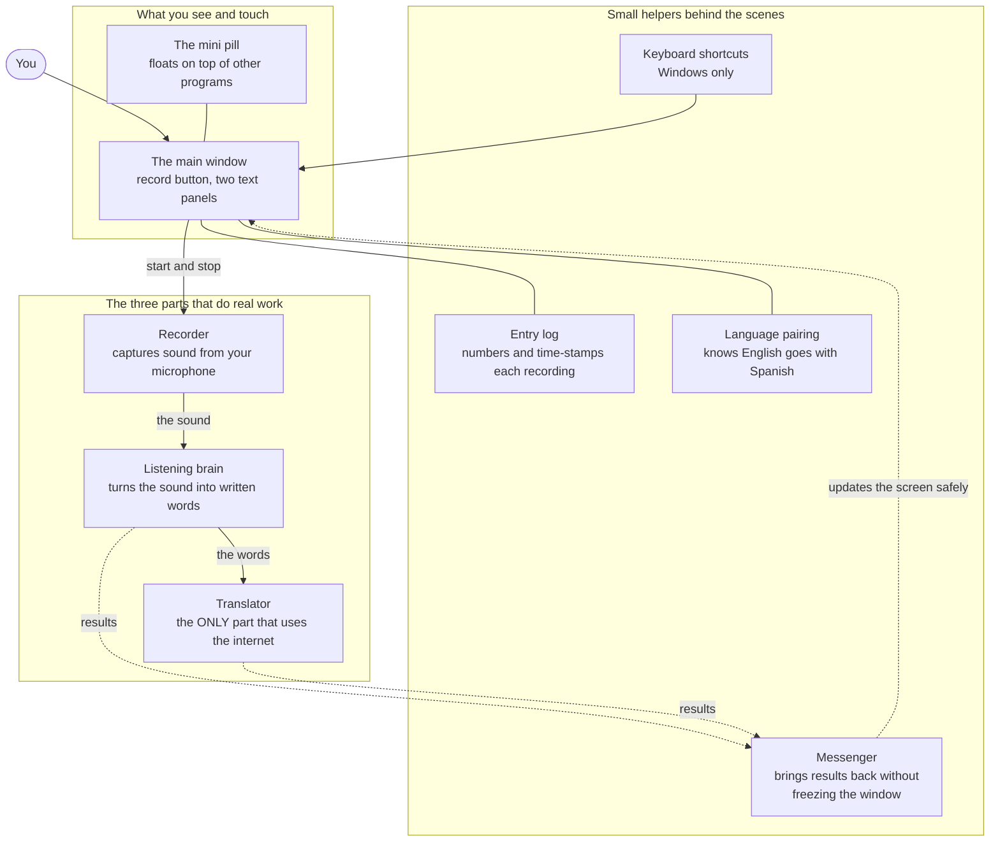

# How this app works, in plain English

A guide for anyone who wants to understand what Speech to Text does and how,
without needing to read the code. No programming knowledge assumed. Where a
technical word is genuinely useful, it is explained the first time it appears.

---

## The short version

**You talk. It types. In two languages at once.**

You press a button, speak in English or Spanish, and press stop. A second or
two later your words appear on screen as properly punctuated text - and the
translation appears right next to it. The text is already on your clipboard,
ready to paste into an email, a document, or a chat window.

The part that matters most: **the listening happens on your own computer.**
Your voice is never uploaded anywhere.

---

## The problem it solves

Typing is slow. Most people speak around 150 words a minute and type around 40.
For anyone who works across two languages, it is worse: you write the message,
then you write it again in the other language, or you paste it into a
translation website and hope.

There are already dictation tools. They tend to have three problems:

| The usual problem | What this app does instead |
|---|---|
| **Your voice goes to a company's servers.** Most dictation is a cloud service - your audio is uploaded, processed on someone else's machine, and often kept. | The speech recognition runs on your own computer. The audio never leaves it, and is never saved to disk. |
| **You have to tell it which language you are speaking.** Switching means clicking a menu every time. | It works out the language by itself, sentence by sentence. You can switch mid-conversation and it keeps up. |
| **You get one language out.** Translation is a separate step in a separate tool. | Both languages appear side by side, automatically, every time. |

It is built for the person who genuinely lives in two languages: writing to an
English-speaking colleague in the morning and a Spanish-speaking client in the
afternoon, and tired of doing everything twice.

---

## Who it is for

- Anyone bilingual in English and Spanish who writes a lot
- People who think out loud better than they type
- Anyone who wants dictation but is not comfortable sending their voice to a company
- People with limited mobility or anyone for whom long typing sessions are uncomfortable

---

## The one idea worth understanding

Almost everything sensible about this app comes from a single decision:
**the hard part runs on your machine, not on the internet.**

> **Jargon, defined:** *running locally* means the work happens on the computer
> in front of you, using its own processor - like a calculator, which does not
> phone anyone to add two numbers. The opposite is *running in the cloud*,
> where your data is sent over the internet to a company's computers, which do
> the work and send the answer back. Most voice assistants work in the cloud.

This has three practical consequences:

1. **Privacy.** Your voice cannot be leaked, subpoenaed, or used for training,
   because it never goes anywhere.
2. **It works offline.** On a plane with no wifi, dictation still works. Only
   the translation needs internet - and you can switch that off.
3. **There is a one-time download.** The app needs the "listening brain" on
   your machine, and that file is large. The first launch downloads it once
   (about 460 MB, roughly a long film). After that, it starts in seconds.

> **Jargon, defined:** the listening brain is called a *speech model*. Think of
> it as an enormous, very detailed reference book that maps sounds to words -
> built once by researchers, then copied onto your computer so it can be
> consulted instantly without asking anyone. This one is called **Whisper**,
> and it is free and open. Because it is a fixed reference book rather than a
> live service, it behaves the same today as it will next year.

---

## The main features

**Speak either language, no switch to flip.** Say a sentence in English, then
one in Spanish. Each lands in its own panel. The app shows how confident it is
about the language it detected, as a percentage.

**Both languages, always.** The screen is split in two: English on the left,
Spanish on the right. Whichever one you spoke goes into its panel, and the
translation goes into the other. Each panel therefore always holds the whole
conversation in one language - useful when you want to send the Spanish version
to one person and the English version to another.

**Everything is editable.** The two panels are ordinary text boxes. Fix a name,
delete a sentence, type something the app never heard. Right-click for
cut/copy/paste, and the usual keyboard shortcuts all work.

**Each recording is its own entry.** Every time you record, the app starts a
new block with a small grey header like `#3 · 2:41 PM`, so a long session stays
readable. **Those headers are for reading only** - when you copy the text, they
are stripped out automatically, so what you paste is just the words. When you
*save* a transcript to a file, the headers are kept, because a saved record is
worth timestamping.

**Automatically copied.** As soon as your words appear, they are on the
clipboard. Speak, then paste. No selecting.

**Mini mode.** The window collapses into a small floating pill that sits on top
of whatever else you are doing, with just a record button and a level meter.
Drag it wherever you like. This is what makes the app usable *while* writing in
another program.

**Keyboard shortcuts from anywhere (Windows).** `Ctrl+Alt+R` starts and stops
recording even when the app is not the window you are looking at. On Mac this
is not available, because macOS requires administrator powers for it, which the
app deliberately does not ask for.

**A genuine off switch for the internet.** One checkbox, *Translate (online)*.
Untick it and the app makes **zero** network connections. Nothing at all leaves
your computer.

---

## The user journey, start to finish

Here is the whole path from opening the app to saving your work. Diamonds are
points where the app takes a different path depending on the situation.

**Reading it in words:** the only slow step is the very first launch, and only
once. After that the loop is press, speak, stop, and your text is there and
already copied. Everything after that is optional - translate it, edit it, save
it, or just paste and move on.

---

## Where your words actually go

This is the diagram worth reading carefully, because it answers the question
people most want answered: *what leaves my computer, and when?*

Below, each column is a participant, and time runs downwards. Arrows are things
being handed from one to another.

**Reading it in words:** your voice makes exactly one journey - from the
microphone into your computer's memory, and then into the listening brain,
which is also on your computer. It stops there. It is never written to a file
and never uploaded.

The **only** thing that can ever leave your machine is the *finished text*, sent
to Google Translate, and only if you have left that checkbox ticked. If you are
dictating something sensitive, untick it and the app is completely sealed.

---

## The parts inside, and how they fit together

You do not need this section to use the app. It is here for the semi-technical
reader who wants to know how it is put together - and because the shape is
genuinely simple.

Think of it like a small kitchen. There is the counter you see and touch, a few
appliances that do real work, and some drawers of small tools that keep
everything organised.

**Reading it in words:**

- **Solid arrows** are the main path: the window starts the recorder, the
  recorder hands sound to the listening brain, the brain hands words to the
  translator.
- **Dotted arrows** are results coming *back*. They all go through one place
  called the **Messenger**, and that is deliberate. Explained below.
- The **helpers** on the right do not touch your audio at all. They just keep
  things tidy.

### Why there is a "Messenger"

This is the one piece of internal design worth explaining, because it is the
reason the app does not freeze.

Understanding what you said takes a second or two. If the app did that work
while you waited, the whole window would lock up - no moving the mouse, no
clicking, the spinning wheel. So instead the slow work happens **in the
background**, like putting something in the oven and going back to chopping
vegetables.

But that creates a classic problem: the background worker finishes and wants to
put text on the screen, while the window is busy doing something else. Two
things writing to the same screen at the same moment can crash the program
outright. (This is a real, well-known category of bug, and it *did* crash this
app before it was fixed.)

The Messenger solves it with a rule that never bends: **background workers are
not allowed to touch the screen.** They leave their results in a tray, and the
window picks the tray up about sixty times a second and does the drawing
itself. One thing draws, so nothing collides.

---

## The listening brain: what it is, and where it came from

This section is for the reader who wants to know what is actually inside. It is
the one genuinely technical part, kept as plain as the subject allows.

### It is called Whisper, and it is OpenAI's

Whisper was built and released by **OpenAI in September 2022**. Two things came
out at once, which is unusual: the *code* **and** the *trained model itself*.
Plenty of "open" AI publishes the recipe but keeps the cake. Whisper published
both, under the **MIT licence** - the most permissive there is. Anyone may use
it, change it, and ship it inside a product, commercially, for free, forever.

That licence cannot be taken back for a version already released. Whatever
OpenAI does next, the copy on your disk keeps working.

**Why give it away?** Most likely because speech recognition was already a
commodity - Google, Apple and Amazon all had one - so there was little revenue
to protect, and a free excellent recognizer makes the expensive things OpenAI
*does* sell more useful. The result is that a small open-source project can
have world-class dictation without paying anyone.

### How it turns sound into words

Roughly three steps:

1. **The sound becomes a picture.** Your audio is cut into 30-second windows
   and converted to a *spectrogram* - a chart of which frequencies are loud at
   each instant. Think sheet music rather than a wiggly waveform.
2. **One half reads the whole picture.** A part called the **encoder** looks at
   all 30 seconds at once and builds an internal summary of what it heard.
3. **The other half writes it out.** The **decoder** produces text one small
   piece at a time, each time looking at both that summary and everything it
   has already written.

Step 3 is why it punctuates well and spells names correctly. It is not matching
sounds against a dictionary - it is **predicting the most likely next piece of
text**, with the audio as context, much the way a phone keyboard predicts your
next word but far better. It writes "their" rather than "there" because the
sentence so far makes it more likely.

It learned all this from **680,000 hours** of audio collected from the web
together with its existing captions, in about 99 languages. That messy,
multilingual diet is exactly why it copes with accents and switching languages
mid-sentence, and why detecting the language is free: it was trained to predict
which language a clip was, alongside the words. That prediction is the
percentage you see in the app's badge.

### Where the files actually come from

The app does not use OpenAI's original code. It uses **faster-whisper**, a
rebuild by a company called SYSTRAN that runs several times quicker on the same
computer and uses less memory. Also MIT-licensed. Same Whisper model
underneath, stored more efficiently.

The model files are downloaded from **Hugging Face**, the standard public host
for open AI models - think GitHub, but for trained models rather than code.
Verified as of August 2026:

| What the app asks for | Which public repository it downloads from |
|---|---|
| `small`, `medium`, `large-v3` | `Systran/faster-whisper-...` |
| `large-v3-turbo` | `mobiuslabsgmbh/faster-whisper-large-v3-turbo` |

They land in a shared folder on your computer (`~/.cache/huggingface`) and stay
there, so the download happens once per model, ever.

### What you get by default

You do not choose a model. The app picks one, based on whether your computer
has a graphics card it can use:

| Your computer | Model | Runs on | One-time download |
|---|---|---|---|
| Windows PC with an **NVIDIA graphics card** | `large-v3` | the graphics card | ~2.9 GB |
| Any other Windows PC | `small` | the main processor | ~464 MB |
| Any **Mac** | `small` | the main processor | ~464 MB |

Macs never try the graphics-card path at all. That is deliberate: the software
downloads a model *before* it checks whether the graphics card will work, so
merely asking would pull nearly 3 GB and then throw it away. Skipping the
question saves every Mac user that download.

**Is `small` a compromise?** For English, measurably not. On a test clip, the
`small`, `medium` and largest models produced **byte-for-byte identical**
English text - the small one just did it three times faster. For Spanish there
is a real but narrow difference: `small` writes every word correctly but drops
the accent in *Mondragón* and the opening **¿** on questions. If that matters
to you, the README has a section called *Better Spanish* with a double-click
fix on Windows and one command on Mac.

### Can it be updated later?

Yes, and in three independent ways - none of which requires rebuilding the app:

1. **Pick a different model** with the `STT_MODEL` setting. Nothing is
   recompiled; the new model downloads itself the first time.
2. **Change the built-in default** by editing two lines in
   `src/transcriber.py`.
3. **Upgrade the engine** by bumping `faster-whisper` in the requirements file.
   An automated service already checks weekly for updates.

Only a fixed list of model names is accepted. That is a safety measure: without
it, that setting could be pointed at *any* repository on Hugging Face, which
would be a way to make the app download something it should not. Models known
to be English-only are deliberately kept off the list too, because on a
bilingual app they would quietly mangle Spanish rather than refuse it.

**Is there anything better than Whisper?** As of writing, not for this
particular job. The strongest rivals are either English-only or carry licences
forbidding commercial use - each of which would break something this app
promises. The faster "turbo" version of Whisper was tested here and turned out
to be *slower* on an ordinary processor, so it was not adopted.

## Honest limits

A description that only lists strengths is an advertisement. These are the real
constraints:

**Two languages only.** English and Spanish. The underlying listening brain
recognises about 99 languages, but the app has two panels, and two panels
cannot show three languages. Adding a third is a redesign, not a setting.

**Translation needs the internet, and it goes to Google.** The recognition is
private; the translation is not. That is why it is a visible checkbox rather
than something buried in settings. If it matters, switch it off - the dictation
still works perfectly.

**Recordings stop at 30 minutes.** Sound held in memory costs about 3.8 MB a
minute, so a microphone left running by accident could eventually exhaust your
computer's memory. At the limit the app stops on its own and transcribes what
it captured, rather than crashing.

**Speed depends on your computer.** With a modern NVIDIA graphics card it uses
a larger, more accurate model and runs very fast. Without one, it automatically
picks a smaller model that stays quick on an ordinary processor. On an Apple
Silicon Mac, expect roughly seven times faster than real time - about two
seconds of work for fourteen seconds of speech.

**Mac downloads show a scary warning the first time.** macOS says it "could not
verify" the app. That is because the app is not registered with Apple's paid
developer programme, not because anything is wrong with it. You allow it once
and never see it again. The README has the exact steps.

**Global shortcuts are Windows only.** On macOS they would require giving the
app administrator powers, which is not a reasonable thing to ask for a
dictation tool. In-app shortcuts still work whenever the window is focused.

**It hears what you actually said.** Background noise, heavy crosstalk and very
unusual technical vocabulary all reduce accuracy. On clean dictation it is
excellent, including punctuation and Spanish accents.

---

## Quick glossary

| Term | What it means, plainly |
|---|---|
| **Transcription** | Turning spoken sound into written words. |
| **Running locally** | The work happens on your computer, not on a company's. Like a calculator rather than a phone call. |
| **Speech model** | The large reference file that maps sounds to words. Downloaded once, then consulted instantly. This one is called Whisper. |
| **Open source** | The code is public and anyone can read it. You do not have to trust the privacy claims - they can be checked. |
| **The clipboard** | The invisible holding place your computer uses for copy and paste. |
| **Processor / CPU** | Your computer's general-purpose brain. Present in every machine. |
| **Graphics card / GPU** | A specialised chip, originally for games, that happens to be very good at the maths speech recognition needs. Optional here, but much faster. |
| **Freezing** | When a program stops responding because it is busy. This app avoids it by doing slow work in the background. |
| **Unsigned app** | Software not registered with Apple or Microsoft's paid programmes. The operating system warns about it because it cannot confirm who made it - not because it found anything wrong. |

---

## In one paragraph

Speech to Text is a desktop dictation tool for people who work in English and
Spanish. You press record, speak in either language, and press stop; a second
later your punctuated words appear in the correct panel, the translation
appears in the other, and the text is already on your clipboard. The
understanding of your speech happens entirely on your own computer, so your
voice is never uploaded and never saved - the only thing that can ever leave
your machine is the finished text going to a translation service, and a single
checkbox turns even that off.
