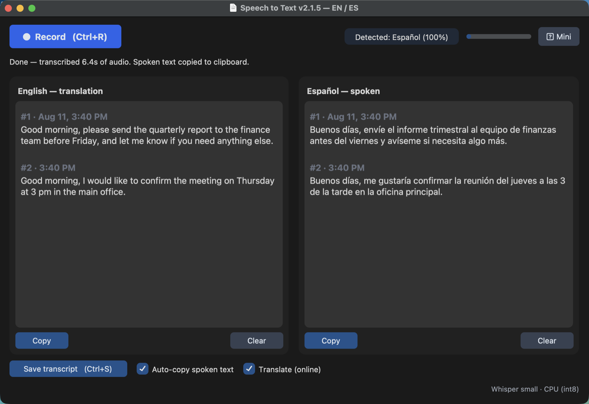
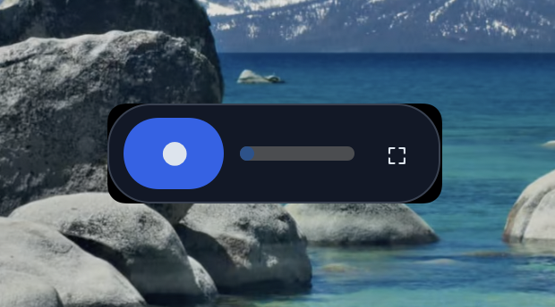

# Speech to Text - EN / ES


Dictate in **English or Spanish** - the app auto-detects the language, transcribes it with OpenAI's Whisper model (running **locally on your
machine**), and shows the text in **both languages** side by side. Both panes are fully editable with native copy/cut/paste.



Two recordings above: the first spoken in English, the second in Spanish. Each
one lands in its own language's pane and is translated into the other, so both
panes always hold the whole conversation in one language. Every recording gets
its own numbered entry (`#1`, `#2`) with the time, and the date appears on the
first entry of the day. Those headers are for reading only - they are never
copied or pasted.

## Features

- 🎙️ **Auto language detection** - speak EN or ES, no switch to flip
- 🌐 **Both languages always shown** - spoken text in its pane, translation in the other
- 🗂️ **One entry per recording** - each dictation starts a new block headed by its number and time; the headers are never copied or pasted
- ✅ **Precise** - Whisper produces punctuated, correctly spelled text
- ⚡ **Fast** - GPU-accelerated on NVIDIA cards (17x realtime on a modern GPU); automatic CPU mode everywhere else
- ⏱️ **No time limit** - Record / Stop whenever you want
- ✏️ **Editable panes** - fix anything by hand; right-click menu, Ctrl+A/C/X/V, undo
- 📋 **Auto-copy** - dictated text lands on your clipboard, ready to paste anywhere
- 🔘 **Mini mode** - collapse to a tiny always-on-top pill at the screen edge
- ⌨️ **Global hotkeys** (Windows) - record from inside any app
- 🔒 **Private by design** - audio never leaves your computer. The translation pane sends each recording's transcribed **text** (never audio) to Google Translate; untick **Translate (online)** and nothing leaves your machine at all

## Install - Windows

### Option A: Download (no Python needed)

1. Go to [**Releases**](../../releases) and download the zip that fits your PC:
   - **`SpeechToText-Windows-GPU.zip`** (~1.5 GB) - for PCs with an NVIDIA GPU (much faster)
   - **`SpeechToText-Windows-CPU.zip`** (~95 MB) - for any Windows PC
2. Unzip anywhere, open the folder, and run **`SpeechToText.exe`**.
3. First launch downloads the speech model once (GPU build ~3 GB, CPU build ~460 MB) - later launches start in seconds.

> **✅ Signed for Windows:** releases from v2.0.1 onward are digitally signed
> by verified publisher **Jose Mondragon** through Microsoft Azure Trusted Signing - right-click `SpeechToText.exe` → *Properties → Digital Signatures* to verify. 

### Option B: Run from source

```bash
git clone https://github.com/mondragon-developer/easy-bilingual-voice-to-text.git
cd easy-bilingual-voice-to-text
pip install -r requirements.txt
python main.py
```

Requires Python 3.10+. GPU acceleration needs an NVIDIA card with recent
drivers; otherwise the app automatically uses CPU mode.

## Install - macOS

### Option A: Download (no Python needed)

1. Go to [**Releases**](../../releases) and download
   **`SpeechToText-macOS-AppleSilicon.dmg`** (~75 MB).
2. Open it and drag **SpeechToText** onto **Applications**.
3. macOS will refuse to open it the first time, because the app is not signed
   by Apple. See below - it is two clicks, once.
4. First launch downloads the speech model once (~460 MB); later launches start
   in seconds.

The app brings its own Python and its own Tk, so **none of the Python setup in
Option B applies to it** - that is the whole point of the download.

> **⚠️ Apple Silicon only.** M1 and later. PyInstaller cannot cross-compile, so
> an Intel Mac needs Option B for now.

> **⚠️ Unsigned, so Gatekeeper will block it.** Signing an app for macOS needs a
> paid Apple Developer account, which this project does not have yet. Nothing is
> wrong with the download; macOS simply cannot tell who built it. To allow it:
>
> - **macOS 15 Sequoia and later:** double-click the app, accept the refusal,
>   then open *System Settings > Privacy & Security*, scroll to the message
>   about SpeechToText, and click **Open Anyway**.
> - **macOS 14 and earlier:** right-click the app > **Open** > **Open**.
>
> You do this once. If you would rather not run unsigned software, Option B
> builds the identical app from source on your own machine.

Verify the download against `checksums.txt` on the release page:

```bash
shasum -a 256 ~/Downloads/SpeechToText-macOS-AppleSilicon.dmg
```

### Option B: Run from source

Three steps, and **step 1 is not optional** - skipping it is the one mistake
that makes the app open a black window with no error to explain it.

#### Step 1 - get a Python that works

> **⚠️ Do not use Apple's built-in `python3`.** The `/usr/bin/python3` that
> ships with macOS is Python 3.9 bundled with **Tk 8.5**, which no longer
> works on recent macOS: the window opens and then stays blank, a black
> rectangle that never paints. Nothing in the app can work around it, and it
> prints no error - it just sits there. If you see the startup warning
> `The system version of Tk is deprecated`, you are on that Python.

Pick either option below. Both install *alongside* Apple's Python and leave
`/usr/bin/python3` untouched.

**Either: the python.org installer** (needs an admin password)

Download the macOS 64-bit universal2 installer for Python 3.12 from
[python.org/downloads/macos](https://www.python.org/downloads/macos/) and run
it. Your interpreter is then:

```bash
PY=python3.12
```

**Or: a local copy, no admin password needed**

```bash
mkdir -p ~/.local/pythons && cd ~/.local/pythons
curl -sSL -o cpython.tar.gz https://github.com/astral-sh/python-build-standalone/releases/download/20260807/cpython-3.12.13%2B20260807-aarch64-apple-darwin-install_only.tar.gz
tar xzf cpython.tar.gz && mv python python-3.12.13
```

That URL is for Apple Silicon; swap `aarch64` for `x86_64` on an Intel Mac.
Your interpreter is then:

```bash
PY=$HOME/.local/pythons/python-3.12.13/bin/python3.12
```

**Check it before going on.** This must print **8.6 or higher** and open a
window that actually draws a button (close the window to continue):

```bash
$PY -c "import tkinter; print(tkinter.TkVersion); tkinter.Button(tkinter.Tk(), text='ok').pack(); tkinter.mainloop()"
```

If it prints `8.5`, or the window is blank, you are still on the wrong Python.

#### Step 2 - install and run

With `$PY` set from step 1, in the same terminal:

```bash
git clone https://github.com/mondragon-developer/easy-bilingual-voice-to-text.git
cd easy-bilingual-voice-to-text
$PY -m pip install -r requirements.txt
$PY main.py
```

First launch downloads the `small` speech model once (~460 MB) before the
window becomes useful; after that it starts in a few seconds. To check
everything works without opening a window:

```bash
$PY main.py --selftest      # prints SELFTEST OK and exits 0
```

#### Step 3 - make it one word (optional)

`$PY` only lasts as long as that terminal, and typing the full path every time
gets old. Add an alias so the right Python is baked in:

```bash
echo "alias stt='$PY $PWD/main.py'" >> ~/.zshrc && source ~/.zshrc
```

Now `stt` launches the app from anywhere.

#### Which version am I on?

Running from source means you get whatever `git clone` gave you - the tip of
`main`, which is at or ahead of the newest tag on the
[Releases](../../releases) page. To see what you have, and to update:

```bash
$PY -c "import src; print(src.__version__)"    # e.g. 2.1.5
git pull                                        # get the latest fixes
```

Nothing else is needed after a `git pull` unless `requirements.txt` changed.
**Update if you are below 2.1.5** - earlier versions wasted a 3 GB download on
every Mac and could crash on startup.

### macOS notes

- **Microphone permission**: the first recording triggers a permission prompt (or enable it in *System Settings > Privacy & Security > Microphone* for your terminal/Python).
- **Speed**: there is no NVIDIA CUDA on Mac, so transcription runs on CPU and the app automatically selects the lighter `small` model. Measured on an M5 Pro, that transcribes roughly **7x faster than real time**: about 2 seconds for a 14-second dictation, with punctuation, accents and EN/ES detection all correct.
- **`small` is the right default.** `STT_MODEL=medium` is roughly 3x slower for identical output on clean dictation. Reach for it only if the app keeps mishearing you on hard audio (strong accent, background noise, unusual technical vocabulary).
- **Global hotkeys** (Ctrl+Alt+R from other apps) are not available on macOS without running as root, so the app skips them entirely there. In-app shortcuts (Ctrl+R / Ctrl+S) still work.

A *signed* Mac download (no Gatekeeper warning), an Intel build, working global
hotkeys, and the rounded mini pill are all still planned.

## How to use

| Action | How |
|---|---|
| Start / stop recording | **● Record** button, `Ctrl+R`, or `Ctrl+Alt+R` from **any** app (Windows) |
| Mini mode / restore | **🗕 Mini** button or `Ctrl+Alt+M` (Windows) |
| Copy a pane | **Copy** button under the pane (entry headers are left out) |
| Save both languages to .txt | **Save transcript** or `Ctrl+S` (headers kept) |
| Edit text | Click and type; right-click for Cut/Copy/Paste; `Ctrl+Z` undo |
| Auto-copy after dictation | Checkbox in the bottom bar (on by default) |
| Translation on/off | **Translate (online)** checkbox - untick to stay 100% offline |

### Mini mode

Press **🗕 Mini** and the window collapses to a small always-on-top pill:
record button, level meter, and a restore button. It stays above every other
window and you can **drag it anywhere on screen**, so you can dictate straight
into whatever you are writing without giving up the space a full window takes.



Right-click the pill for *Restore window* or *Exit app*. On macOS it sits on a
dark rectangle, as above; the rounded, fully transparent version is Windows
only for now.

**Dictate-anywhere workflow (Windows):** minimize to the pill → `Ctrl+Alt+R` → speak → `Ctrl+Alt+R` → wait for the green ✓ → `Ctrl+V` in
whatever app you're writing in.

Each recording **appends**: the spoken text goes to its language's pane and the translation to the other, so each pane always holds the full transcript in one language - even if you switch languages between recordings.

Every recording is its own **entry**, set off by a blank line and a small gray header with a number and the time (`#3 · 2:41 PM`) - the date is added on the first entry of the day. Both panes use the same number and time for a given recording, so the two sides line up. Numbering restarts at `#1` once both panes are empty.

The headers are for reading, not for pasting: **Copy**, `Ctrl+C` on a selection, `Ctrl+X`, and auto-copy all leave them out, so you paste only the
words. **Save transcript** is the exception - the `.txt` file keeps the headers, since a saved transcript is a record of when things were said.

## Choosing a model

The app picks automatically: `large-v3` (best accuracy) on NVIDIA GPUs, `small` (fast) on CPU. Override with the `STT_MODEL` environment variable:
`tiny`, `base`, `small`, `medium`, `large-v3`, `distil-large-v3`.

## Privacy & security

- Speech recognition runs **100% locally** - your voice never leaves the machine. Models are downloaded once over HTTPS from the official
  `huggingface.co/Systran/faster-whisper-*` repositories.
- When **Translate (online)** is ticked (default), the latest recording's **transcribed text** (never audio, never your edits) is sent to Google
  Translate. No account, no API key. **Untick it and the app makes zero network calls.**
- **About the global hotkeys (Windows):** Ctrl+Alt+R / Ctrl+Alt+M are implemented with the Python [`keyboard`](https://github.com/boppreh/keyboard)
  library, which registers a system-wide keyboard hook - the standard technique every hotkey utility uses, and one some antivirus tools flag
  because keyloggers use hooks too. This app registers exactly two hotkey patterns and **never reads, stores, or transmits keystrokes** - the        entire usage is ~10 lines in [`src/app.py`](src/app.py) (`_register_global_hotkeys`),
  and the hook is released on exit. On macOS and Linux the hook needs elevated permissions, so the app simply disables global hotkeys there.
- Auto-copy writes to your clipboard only when the checkbox is on.
- No telemetry, no analytics, no accounts. Transcripts are saved only when you click Save. Audio is never written to disk.
- **Signed, reproducible releases:** Windows binaries are code-signed (Azure Trusted Signing, verified publisher), built by GitHub Actions from
  the exact versions in `requirements-lock.txt` - the build logs are public in the Actions tab - and published with SHA-256 checksums.
- **Supply chain:** `requirements-lock.txt` pins exact versions *and* artifact hashes, installed with `--require-hashes`, so a hijacked re-upload    to PyPI fails the build rather than shipping inside a signed binary. Every GitHub Action is pinned to a commit SHA instead of a movable tag,       keeping a compromised action away from the signing secrets. Dependabot updates both weekly. To report a vulnerability.

## Troubleshooting

| Problem | Fix |
|---|---|
| **macOS: "cannot be opened because Apple cannot check it"** | Expected - the `.dmg` is unsigned. *System Settings > Privacy & Security > Open Anyway*, or right-click > Open on macOS 14 and earlier |
| **macOS: the window opens but stays black** | Only happens running from source on Apple's `/usr/bin/python3` (Tk 8.5). See [Install - macOS](#install---macos) Option B step 1, or just download the `.dmg` |
| **macOS: nothing happens for several minutes on first launch** | On v2.1.4 and earlier, every Mac downloaded 3 GB it could not use. `git pull` to 2.1.5+, then `rm -rf ~/.cache/huggingface/hub/models--Systran--faster-whisper-large-v3` |
| "Could not open the microphone" | Check the OS default input device and mic permissions |
| Status says CPU but I have an NVIDIA GPU | Update NVIDIA drivers; the status bar shows the exact CUDA error |
| Translation pane says translation failed | You're offline or Google is unreachable - the spoken pane still works |
| First start is slow | The model downloads once to `~/.cache/huggingface`; later starts are fast |
| "Model failed to load: [WinError 3]" | You're on v2.0.0/v2.0.1 - [update to v2.0.2+](../../releases/latest), which fixed this packaging bug |

### Verify your download

- **Integrity:** compare your zip's SHA-256 against `checksums.txt` attached to the release - `Get-FileHash SpeechToText-Windows-*.zip` in     PowerShell.
- **Authenticity:** right-click `SpeechToText.exe` → *Properties → Digital Signatures* - the publisher is Jose Mondragon.
- **Health:** run `SpeechToText.exe --selftest` - it loads the speech model and transcribes a test signal without opening a window, writes `selftest.log`, and exits with code 0 when everything works. CI runs this exact check on every release before it can publish.

## Development

```bash
pip install -r requirements.txt -r requirements-dev.txt
python -m pytest tests/        # 60 tests
```

```
main.py              entry point
src/
  recorder.py        threaded 16 kHz mic capture (sounddevice -> numpy)
  transcriber.py     faster-whisper wrapper + language auto-detection
  translator.py      EN<->ES translation with sentence-aware chunking
  app.py             CustomTkinter two-pane UI, mini mode, global hotkeys
tests/               pytest suite (logic, recorder, transcriber, translator, UI)
scripts/
  build_release.ps1  Windows: PyInstaller -> the two release zips
  build_macos.sh     macOS: PyInstaller -> .app -> .dmg (unsigned)
  lock_hashes.py     regenerates requirements-lock.txt from the PyPI API
```

Both build scripts take a stage argument so CI can sign between building and
packaging, and both are what the release workflow actually runs - there is no
separate CI-only build path to drift out of sync.

### Dependencies

`requirements-lock.txt` is what release builds install, and it carries artifact hashes, so any version change has to be followed by:

```bash
python scripts/lock_hashes.py
```

That rewrites the file from the PyPI API. The pinned set must be the complete resolved closure - under `--require-hashes` pip refuses to install anything missing a pin, so a forgotten transitive dependency fails the release build.

## License

[MIT](LICENSE) © 2026 Jose Mondragon
